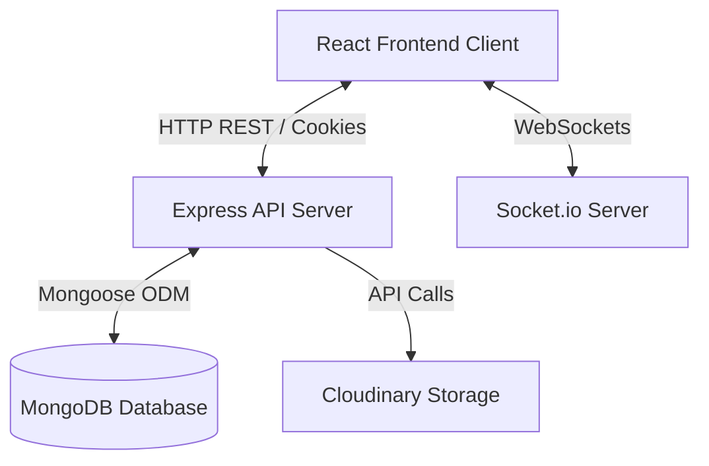
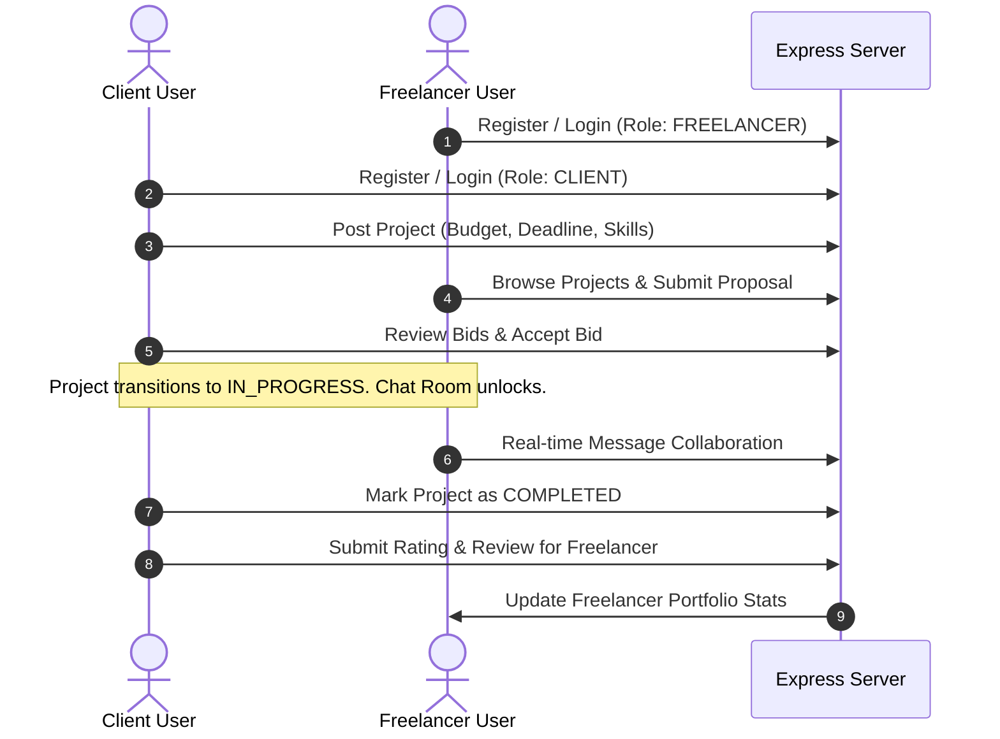

# peerLance - Freelance Bid Portal for Students

peerLance is a production-ready, full-stack MERN (MongoDB, Express, React, Node.js) web application designed to serve as a freelance bidding platform for university students. The portal enables student developers, designers, and creators to discover and bid on projects posted by clients, coordinate work through real-time communication channels, deliver projects, and build verified professional portfolios.

---

## Project Architecture

The application is built on a split architecture containing a decoupled frontend client and backend API server, using Socket.io for bi-directional real-time events.



1. **Frontend Client (SPA)**: Built with React 19, Vite, Tailwind CSS v4, and Zustand. It interacts with the backend server via Axios (using credentials-enabled cookie sessions) and manages live listeners using Socket.io-client.
2. **Backend API Server**: An Express.js application handling JWT authentication, cookie management, validations, business logic, and file storage.
3. **Database Layer**: MongoDB document database modeled with Mongoose ODM to enforce strict schemas for users, projects, bids, messages, and reviews.
4. **Real-Time Layer**: Socket.io integration to manage user-specific channels and project-specific chat channels.

---

## Features

### User Authentication and Role Guards
* Secure registration and login flows.
* Cookie-based JSON Web Token (JWT) storage (HttpOnly, Secure, SameSite protection).
* Role-based Route Guarding (`CLIENT` and `FREELANCER` access control).

### Project Management
* Clients can post project opportunities with title, descriptions, budget ranges, required skills, deadlines, and attachment reference files.
* Free text and tag-based filtering of open opportunities with pagination.
* Bookmark and save listings for future review.

### Proposal Bidding Engine
* Freelancers can submit proposals with proposed pricing, delivery timelines, and detailed cover notes.
* Clients can review submitted bids and accept/reject them.
* Acceptance of a proposal locks the project to `IN_PROGRESS` status and auto-rejects other pending bids.

### Real-Time Chat System
* Automatic project-scoped chat room initialization once a proposal is accepted.
* Live message synchronization and delivery status checkmarks.
* Active typing status indicators.

### In-App Notification Center
* Instant notification badges in the navigation header for new bids, acceptance/rejections, project completions, and reviews.
* Real-time notifications powered by web socket rooms.

### Ratings & Reviews Portfolio
* Feedback review triggers upon project completion.
* Star rating selection and commentary fields to establish peer reputation.
* Dynamic calculation of freelancer average rating scores shown on public profiles.

---

## Technology Stack

| Technology | Purpose in Project | Choice Rationale |
| :--- | :--- | :--- |
| **React 19** | Frontend Framework | Declarative component UI model with high performance using Concurrent Rendering. |
| **Vite** | Frontend Build Tool | Extremely fast Hot Module Replacement (HMR) and optimized build bundling. |
| **Tailwind CSS v4** | Component Styling | Utility-first framework providing consistent theme configurations and responsive grids. |
| **Zustand** | State Management | Light, non-boilerplate state stores for modularizing auth, projects, bids, and chat. |
| **Node.js** | Runtime Environment | High-performance asynchronous JavaScript engine for server execution. |
| **Express.js** | API Framework | Minimalist routing layer for building scalable RESTful APIs. |
| **MongoDB** | Database Store | Document-based structure mapping directly to JavaScript objects and model requirements. |
| **Mongoose** | Object Document Mapper | Simplifies schema validation, middleware hooks, and references query population. |
| **Socket.io** | WebSockets Protocol | Bi-directional communication channel for instant messages and notifications. |
| **JWT** | Session Authentication | State-free security token transmitted securely through browser cookie headers. |
| **Multer & Cloudinary**| File Attachment Uploads | Handles multipart file inputs and uploads files directly to cloud storage CDN. |
| **Axios** | HTTP Request Client | Handles automatic base URL setup, credential sharing, and unauthorized redirect interceptors. |
| **React Router 7** | Client-side Router | Provides layouts, role guarding, and query parameters management. |

---

## System Workflow



---

## Folder Structure

```text
peerLance/
├── backend/
│   ├── config/             # DB and service configurations
│   ├── middleware/         # Auth, validation, and rate limiting middlewares
│   ├── models/             # Mongoose database schemas
│   ├── routes/             # Express API routers
│   ├── utils/              # Helper utilities (Cloudinary, email, JWT)
│   ├── validation/         # Zod schemas for input validation
│   ├── server.js           # Server entry file (Socket.io initialization)
│   └── package.json
├── frontend/
│   ├── public/             # Static public assets
│   ├── src/
│   │   ├── api/            # Axios instance and interceptors
│   │   ├── components/     # Reusable UI components
│   │   ├── pages/          # View components / layouts
│   │   ├── store/          # Zustand global state stores
│   │   ├── App.jsx         # App router and path definitions
│   │   ├── index.css       # Tailwind CSS directives and theme vars
│   │   └── main.jsx        # React DOM entry point
│   ├── vite.config.js      # Vite build configurations
│   └── package.json
└── README.md
```

---

## Installation

### Prerequisites
* Node.js (v18 or higher)
* MongoDB Local Community Server or MongoDB Atlas Account
* Cloudinary Account (for file attachments)

### Step 1: Clone the Repository
```bash
git clone https://github.com/your-username/peerLance.git
cd peerLance
```

### Step 2: Configure Backend Environment
Navigate to the `/backend` folder and create a `.env` file based on `.env.example`:
```bash
cd backend
npm install
cp .env.example .env
```
Fill out the variables as described in the **Environment Variables** section.

### Step 3: Configure Frontend Environment
Navigate to the `/frontend` folder and install dependencies:
```bash
cd ../frontend
npm install
```

---

## Environment Variables

### Backend Configuration (`/backend/.env`)

| Variable | Description | Example Value |
| :--- | :--- | :--- |
| **PORT** | Port number for the Express server to listen on | `6868` |
| **MONGO_URI** | MongoDB database connection URI | `mongodb://localhost:27017/peerLance` |
| **JWT_SECRET** | Secret string key used to sign JSON Web Tokens | `your_jwt_signing_secret_key` |
| **COOKIE_SECRET**| Secret string key used to sign cookies | `your_signed_cookies_secret_key` |
| **NODE_ENV** | Runtime environment stage indicator | `development` |
| **CLOUDINARY_CLOUD_NAME** | Cloudinary account cloud identifier | `dzzxxxxx` |
| **CLOUDINARY_API_KEY** | Cloudinary access credentials key | `4728xxxxxxxxxxx` |
| **CLOUDINARY_API_SECRET**| Cloudinary access secret key | `xxxxxxxxxxxxxxxxxxxxxxxx` |
| **EMAIL_USER** | SMTP server dispatch email account | `support@peerlance.com` |
| **EMAIL_PASS** | SMTP email account auth credential password | `smtp_password` |

---

## Running the Project

### Running Backend Server
```bash
cd backend
npm run dev
```
The server will start on `http://localhost:6868` and connect to the MongoDB instance.

### Running Frontend Client
```bash
cd frontend
npm run dev
```
The client will launch a development server on `http://localhost:5173`. Open this URL in your web browser.

---

## Future Enhancements

* **Milestone Payments Integration**: Incorporate an escrow-like payment processing gateway (such as Razorpay or Stripe) to secure budgets.
* **Student Identity Verification**: Validate student roles through university SSO authentication or domain checks (`.edu` emails).
* **Code Sandbox Collaborator**: Enable code editing blocks inside chat rooms for pair-programming reviews.
* **Resume Parsing**: Automatically populate student skills tags by parsing uploaded PDF resumes.
